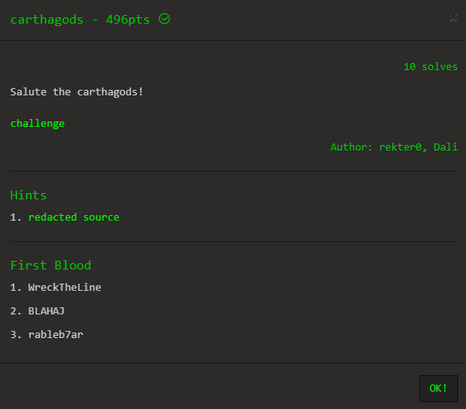
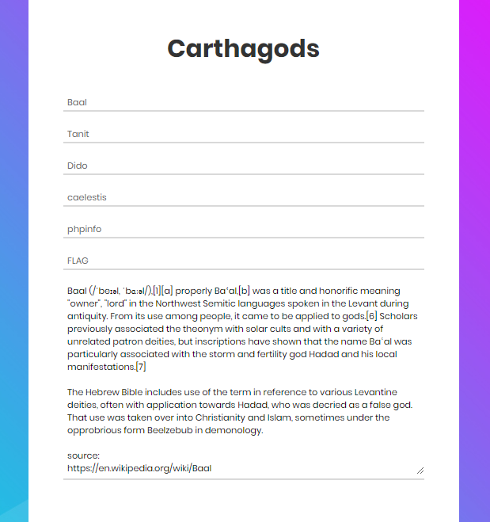
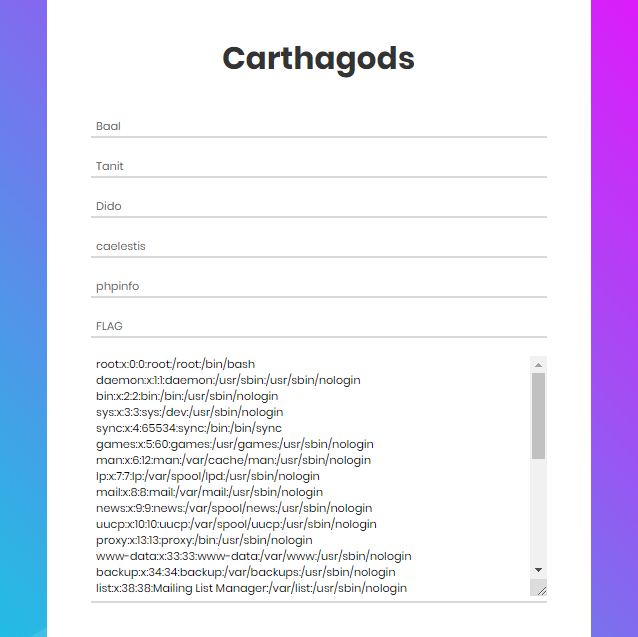
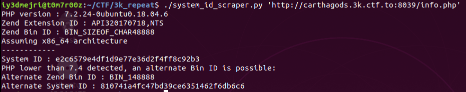
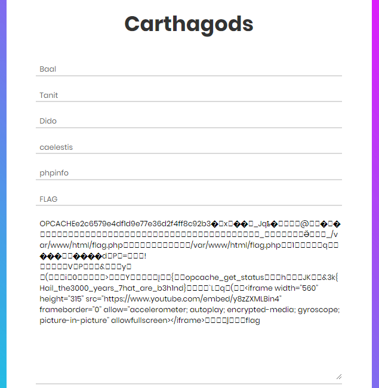

# Carthagods - 496pts (third blood)

## Introduction

This is a writeup about the `carthagods` web exploitation challenge from the 3k CTF 2k20. It's a `sayefi` writeup, so not that much of explaining all the little details and stuff. Hope you enjoy.

## Description



## TL;DR

1. Leak the parameter name used to include files
2. Get some informations about configurations with the given info.php that calls phpinfo() function.
3. Read the flag from the caching system (Zend Opcache) located at /var/www/cache/

## Overview

We are presented with a page that has some choices that turned out they are file names located in the `thecarthagods` directory. Example when visiting http://carthagods.3k.ctf.to:8039/baal:




We also have the phpinfo() located at info.php. And we know from there that the flag is located at flag.php. So the first idea that came to my mind is that we need to get the content of flag.php. We also have the source code of the app added as a hint. Here is the source code of both files `index.php` and `.htaccess`:

```php+HTML
<!DOCTYPE html>
<html lang="en">
<head>
	<title>Carthagods</title>
	<meta charset="UTF-8">
	<meta name="viewport" content="width=device-width, initial-scale=1">
<!--===============================================================================================-->	
	<link rel="icon" type="image/png" href="images/icons/favicon.ico"/>
<!--===============================================================================================-->
	<link rel="stylesheet" type="text/css" href="vendor/bootstrap/css/bootstrap.min.css">
<!--===============================================================================================-->
	<link rel="stylesheet" type="text/css" href="fonts/font-awesome-4.7.0/css/font-awesome.min.css">
<!--===============================================================================================-->
	<link rel="stylesheet" type="text/css" href="fonts/iconic/css/material-design-iconic-font.min.css">
<!--===============================================================================================-->
	<link rel="stylesheet" type="text/css" href="vendor/animate/animate.css">
<!--===============================================================================================-->	
	<link rel="stylesheet" type="text/css" href="vendor/css-hamburgers/hamburgers.min.css">
<!--===============================================================================================-->
	<link rel="stylesheet" type="text/css" href="vendor/animsition/css/animsition.min.css">
<!--===============================================================================================-->
	<link rel="stylesheet" type="text/css" href="vendor/select2/select2.min.css">
<!--===============================================================================================-->	
	<link rel="stylesheet" type="text/css" href="vendor/daterangepicker/daterangepicker.css">
<!--===============================================================================================-->
	<link rel="stylesheet" type="text/css" href="css/util.css">
	<link rel="stylesheet" type="text/css" href="css/main.css">
<!--===============================================================================================-->
</head>
<body>
	
	<div class="limiter">
		<div class="container-login100" style="background-image: url('images/bg-01.jpg');">
			<div class="wrap-login100 p-l-55 p-r-55 p-t-65 p-b-54">
				<form class="login100-form validate-form">
					<span class="login100-form-title p-b-49">
						Carthagods
					</span>

					<div class="wrap-input100 validate-input m-b-23" >
						<span class="label-input100"><a href="./baal">Baal</a></span>
					</div>
					<div class="wrap-input100 validate-input m-b-23">
						<span class="label-input100"><a href="./tanit">Tanit</a></span>
					</div>
					<div class="wrap-input100 validate-input m-b-23">
						<span class="label-input100"><a href="./dido">Dido</a></span>
					</div>
					<div class="wrap-input100 validate-input m-b-23">
						<span class="label-input100"><a href="./caelestis">caelestis</a></span>
					</div>
					<div class="wrap-input100 validate-input m-b-23">
						<span class="label-input100"><a href="./info.php">phpinfo</a></span>
					</div>
					<div class="wrap-input100 validate-input m-b-23">
						<span class="label-input100"><a href="./flag.php">FLAG</a></span>
					</div>

					<div class="wrap-input100 validate-input m-b-23">
						<textarea class="label-input100" style="color:black;width: 100%;height: 300px;"><?php
								if(@$_GET[*REDACTED*]){
									$file=$_GET[*REDACTED*];
									$f=file_get_contents('thecarthagods/'.$file);
									if (!preg_match("/<\?php/i", $f)){
									    echo $f;
									}else{
										echo 'php content detected';
									}
								}
							?>
						</textarea>
					</div>
					
					
					

					
				</form>
			</div>
		</div>
	</div>
	

	<div id="dropDownSelect1"></div>
	
<!--===============================================================================================-->
	<script src="vendor/jquery/jquery-3.2.1.min.js"></script>
<!--===============================================================================================-->
	<script src="vendor/animsition/js/animsition.min.js"></script>
<!--===============================================================================================-->
	<script src="vendor/bootstrap/js/popper.js"></script>
	<script src="vendor/bootstrap/js/bootstrap.min.js"></script>
<!--===============================================================================================-->
	<script src="vendor/select2/select2.min.js"></script>
<!--===============================================================================================-->
	<script src="vendor/daterangepicker/moment.min.js"></script>
	<script src="vendor/daterangepicker/daterangepicker.js"></script>
<!--===============================================================================================-->
	<script src="vendor/countdowntime/countdowntime.js"></script>
<!--===============================================================================================-->
	<script src="js/main.js"></script>

</body>
</html>
```

```RewriteEngine on
options -indexes


RewriteRule ^([a-zA-Z0-9_-]+)$ index.php?*REDACTED*=$1 [QSA]
```

With that being said, we know that we need to leak the `*REDACTED*` parameter's real name in order to be able to include other files on other directories. `NOTE: You can't bruteforce the parameter name.`

We know from the .htaccess, index.php and the info.php file that we have a mod_rewrite enabled and everything we try to access will be passed to index.php as the value of a parameter that will be then included with `file_get_contents()` function. We also know from the `preg_match` that we can't include any files that contains `<?php ` case insensitive on it. Means, that we probably wouldn't be able to just include `flag.php` file and we need to find another way to get around it.

## Exploitation

To leak the `*REDACTED*` parameter's real name, we can try to pass a directory name instead of a file name to it. We can do that by accessing `http://carthagods.3k.ctf.to:8039/images` and it seems to run throw an error and redirect us to `http://carthagods.3k.ctf.to:8039/images/?eba1b61134bf5818771b8c3203a16dc9=images` having the parameter name leaked as `eba1b61134bf5818771b8c3203a16dc9`.

Knowing the parameter name we could try to include `/etc/passwd` for example with `http://carthagods.3k.ctf.to:8039/?eba1b61134bf5818771b8c3203a16dc9=../../../../etc/passwd`. I added `../` because it will try to load the file we input from the `carthagods/` directory.



Nice, from there we will try to include the `flag.php` file now. But again you can't just include it because it contains `<?php` which is filtered by the `preg_match`. That being said, let's get back into reading the `info.php`. Going threw it we can see a caching system being used, and what it's basically doing is storing the precompiled script bytecode in a file. We can know this file name by inspecting the `opcache.file_cache` directive. And it seems to be located at `/var/www/cache/`. So our file will be located at `/var/www/cache/[system_id]/var/www/html/flag.php.bin` with system_id being calculated through Zend and php version numbers used by that system. However, we can calculate the system_id using a python script found here -> https://github.com/GoSecure/php7-opcache-override/blob/master/system_id_scraper.py and passing to it the url to the phpinfo as the first argument.



That being said, we know that system_id = 'e2c6579e4df1d9e77e36d2f4ff8c92b3'. Now, let's try to include `flag.php` using this path `/var/www/cache/e2c6579e4df1d9e77e36d2f4ff8c92b3/var/www/html/flag.php.bin`. Accessing http://carthagods.3k.ctf.to:8039/?eba1b61134bf5818771b8c3203a16dc9=../../../../var/www/cache/e2c6579e4df1d9e77e36d2f4ff8c92b3/var/www/html/flag.php.bin we will get us the precompiled bytecode of `flag.php` followed by the flag :smile:



