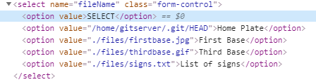

# Introduction


I finally decided to make my first writeup for a ctf challenge, it is a web exploitation one for a challenge called SignStealingSoftware-P2 from the UMDCTF2020. I know it's too late since the ctf has ended 4 days ago but there is no writeups for this challenge :unamused: and so I decided to make one for it :upside_down_face:.

# TL;DR

1. Leak /etc/passwd file with an LFI
2. Target the gitserver user and know that there is a git repo inside his home directory
3. Get the commits made to the repo in order to get the flag

# The Challenge

## description


## Overview

Visiting the website we get a select menu


there is 5 options


the first option is not sending any params with the request to the server so basically it had not effect, the 3 options under it showed some GIF images. Choosing the Home Plate for example would show that


and the last option showed a list.


There is nothing important so far, so let's take a look at the HTML source of the page. This is a screenshot of the important part of the source.


so according to that we know that the form is sending a POST request to the index which is a php file and with a param called fileName that contained a location of one of the files on the server and would render the content of it to us.

## Exploitation

What we would think of in this situation is an LFI (Local File Inclusion) and so we could basically get the content of files on the server that we are not supposed to access.

That being said, let's try to exploit it by changing the value of the option tag to some known files that have a higher chance of existing in the server and that the current user do have permissions to read them.

### Breakpoint

We could get information about the server and the backend by viewing the response headers. This can be done by making a request with curl for example with the -i option to include protocol response headers in the output or by google chrome developer tools and go the Network tab which is what I always use or by using any other tool...) [Example: ]


### Continue

Knowing that the server is Linux (Debian as a distribution) then a good example of such of a file is passwd file in the /etc/ directory which is a text file that contains the basic information of each user or account on a Linux or Unix-like system. That being said, let's change the value of the option tag to /etc/passwd by using the google chrome developer tools (Again you can use curl with -d to send data of a post request by a more practical and fast way is using the developer tools)


Clicking the submit button we are presented with the content of the passwd file which confirms the LFI vuln here.


At the beginning I didn't notice the gitserver user and that it is an interesting user that I should've looked at. But I just was trying some files like /flag|/flag.txt then I tried some files on the webserver like the flag.php or inside the files directory ./files/flag.php but a 404 not found message was always being returned. Then knowing that the backend is php I some php wrappers to read the content of the index.php.

### Breakpoint

php wrappers are responsible for handling protocol related tasks like downloading data from a web or ftp server and exposing it in a way in that it can be handled with php's stream related functions. (Stream is the transmission of data from source to target. Basic forms of sources are files, TCP or UDP network connection, standard input and output..)

### Continue

So I used the wrapper php://filter to encode the content of the index.php with base64 so the payload becamed php://filter/convert.base64-encode/resource=index.php


we got this long base64 string


then decoded it and started reading through it.

```php+HTML
<?php 
$returnContents = [];
error_reporting(0);


if ($_SERVER['REQUEST_METHOD'] === "POST"){
    $regexpText = "/.*\.(txt)/i";
    $regexpImage = "/\.(gif|jpe?g|tiff|png|webp|bmp)$/i";
    $regexpTraversal = "/\.\./";
    $validFile = ['gif', 'txt',  'jpg', 'png'];
    if (isset($_POST['fileName'])) { 
	 
        $ext = substr($_POST['fileName'], -3, 3);
        $imageInServer = ['./files/homeplate.gif', './files/firstbase.jpg', './files/thirdbase.gif'];
        if (in_array($_POST['fileName'], $imageInServer) || $ext === "png" || $ext === "jpg" || $ext === "gif") {
            $returnContents['data'] = "<br>"; 
        } else {
            $contents = file_get_contents($_POST['fileName']);
            if ($contents != false) {
                $contents = explode("\n", $contents);
                $returnContents['data'] = "<ul>";
                for ($i = 0; $i < sizeof($contents); $i++) {
                    $returnContents['data'] .= "<li>" . $contents[$i] . "</li>";
                }
                $returnContents['data'] .= "</ul>";
            } else {
                $returnContents['data'] = "File not found". $_POST['fileName'];
            }
        }
    }
}

?>
<!DOCTYPE html>
<html>
<head>
    <meta charset='utf-8'>
    <meta http-equiv='X-UA-Compatible' content='IE=edge'>
    <title>L33t File Finder</title>
    <meta name='viewport' content='width=device-width, initial-scale=1'>
    <link rel='stylesheet' type='text/css' media='screen' href='./style/main.css'>
    <link rel="stylesheet" href="https://stackpath.bootstrapcdn.com/bootstrap/4.4.1/css/bootstrap.min.css" integrity="sha384-Vkoo8x4CGsO3+Hhxv8T/Q5PaXtkKtu6ug5TOeNV6gBiFeWPGFN9MuhOf23Q9Ifjh" crossorigin="anonymous">
</head>
<body>
    <div class = "container">
        <div class = "row">
            <div class = "col-12">
                <h1 class = "text-center">Baseball Sign Stealing Software</h1>
            </div>
        </div>
        <form action="" method="POST">
            <div class = "row">
                <div class = "col-12">
                    <select name="fileName" class = "form-control">
                        <option value="">SELECT</option>
                        <option value="./files/homeplate.gif">Home Plate</option>
                        <option value="./files/firstbase.jpg">First Base</option>
                        <option value="./files/thirdbase.gif">Third Base</option>
                        <option value="./files/signs.txt">List of signs</option>
                    </select>                    
                </div>
            </div>
            <div class = "row">
                <div class = "col-12 text-center">
                    <br>
                    <input type = "submit" value = "Submit" class = "btn btn-success">
                </div>
            </div>
        </form>

        <div class = "row contents">
            <div class = "col-12 fileContents text-center">
                <?php 
                //if (isset($_GET['fileName'])) { 
                if ($_SERVER['REQUEST_METHOD'] === "POST") {
                    echo $returnContents['data']; 
                } ?>
            </div>
        </div>
    </div>
    <script src="https://ajax.googleapis.com/ajax/libs/jquery/3.4.1/jquery.min.js"></script>
    <script src="https://cdn.jsdelivr.net/npm/popper.js@1.16.0/dist/umd/popper.min.js" integrity="sha384-Q6E9RHvbIyZFJoft+2mJbHaEWldlvI9IOYy5n3zV9zzTtmI3UksdQRVvoxMfooAo" crossorigin="anonymous"></script>
    <script src="https://stackpath.bootstrapcdn.com/bootstrap/4.4.1/js/bootstrap.min.js" integrity="sha384-wfSDF2E50Y2D1uUdj0O3uMBJnjuUD4Ih7YwaYd1iqfktj0Uod8GCExl3Og8ifwB6" crossorigin="anonymous"></script>
</body>
</html>
```


We could understand from the above php code that it checks if the request is POST then it declares and initializes some variables wich have some regex pattern inside of it but this variables are not called again then it checks that we have passed the param fileName, gets it's extension and if it is a .png, .jpg, .gif or one of the files inside that the $ImageInServer variable then it puts it inside an  tag and if it doesn't match any of the conditions being said then it will get it's content with the file_get_contents() function if the file exists then it splits it by lines and makes an unordered list with it by using the <li> and <ul> tags otherwise it will return the File not found string with the filename next to it. Since it's using the file_get_contents() function so we can't include files from outside the server and there is nothing else interesting in the source code. So afters some minutes thinking what to do, I decided to check back the /etc/passwd file maybe there is an interesting user that might have the flag inside their home directory.

Including the /etc/passwd file again.


I noticed that the gitserver user is a good target so I tried including the /home/gitserver/flag and /home/gitserver/flag.txt files but the server returned File not found :cry:.


But isn't the gitserver user hinting that maybe there is a git repo inside the home of the user a good file to check for then is /home/gitserver/.git/HEAD



and yes we got the file!


Of course we can't dump this repo by using some tools like the gitdumper because it is a local file and not shared with the web server so before even starting to write our own tool for this I wanted to check the commits made to this repo and there is a file located at .git/logs/HEAD which contains this informations. So changing the value of the option to it.


and hitting the submit button we got two commits.


This base64 string looks interesting, so I copied it and decoded it and surprisingly it was the flag :rofl:

