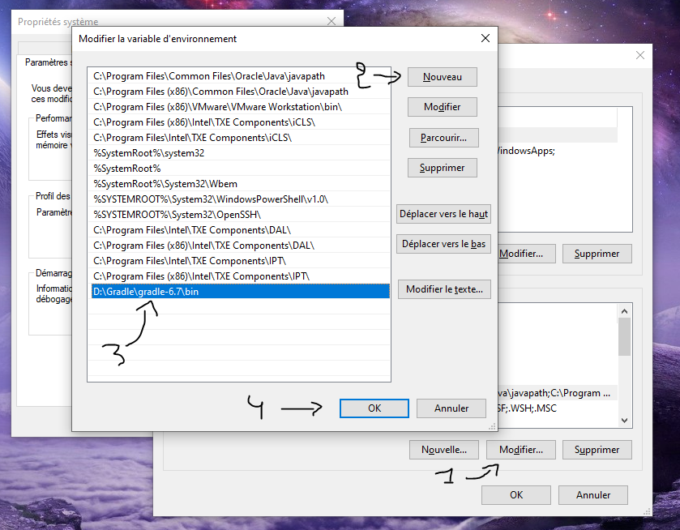
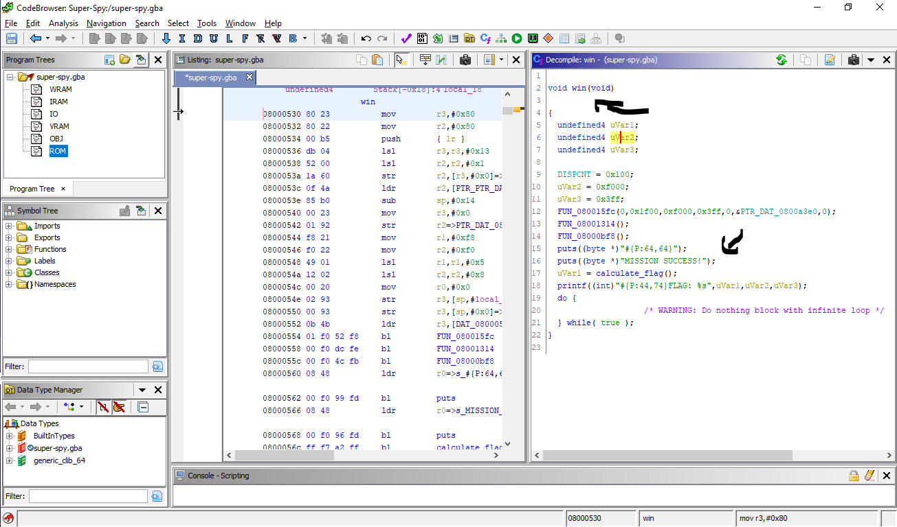

# Introduction

I enjoyed a reverse engineering task from the b01lersCTF BootCamp 2020, called Super Spy. It's a challenge about reverse engineering a Game Boy Advance game and getting the flag. This writeup is going to bit a special since I'm going to showcase how to get the flag through the reverse engineering trip and also patch the game to get the flag from different angles. That being said, let's dig into it!

**NOTE**: Just a little note to say that this writeup is published too late after the CTF has ended and that I'm now on a new computer so you might see two different terminals or Desktops in the writeup. Also if you are wondering, yes I solved this task during the CTF lol. Enjoy!

# TL;DR

1. Reverse engineer the game and get the function calculating the flag
2. Try to implement the same function in any programming language
3. Execute and get the flag or just patch the game and redirect the execution flow to the function showing the flag.

# The Challenge

## Description


## Getting What We Need

It's nice from the author to provide the tools needed to solve the challenge and trying to help everyone. First of all, we need to install Ghidra which is the famous free and open source reverse engineering tool developed by the NSA. You can find it on their official website here: https://ghidra-sre.org/. After getting it installed we will need an extension that understands the GameBoy Advance opcodes (opcodes are the lower level representation of the instruction and it's going to be executed by the processor telling it what to do) so we can have the disassembly view and the pseudo code of what the actual source code of the program might look like. An extension to do this job loading the GameBoy Advance ROM is already provided in the description above and you might of course find it with a quick Google.

### Installing GhidraGBA Extension

I'm actually using Ghidra on Windows but I will showcase the same things in Linux too. First of all here is the link to the Github repo containing the extension: https://github.com/SiD3W4y/GhidraGBA. So if you are on Windows you can click on the green Code button at the top and then click on `Download ZIP`:


Or you could download the Git Desktop Tool for windows and clone the repository with it. On Linux you can go that way download the ZIP file and then decompressing it or you could download and install the git tool, then enter the command `git clone https://github.com/SiD3W4y/GhidraGBA.git` and you will have a new created folder with the files of the Github repository.


After decompressing and extracting the files from the ZIP file we need a tool called `Gradle` which is an open source build automation tool that supports multi-language and multi-platform software development. Before installing Gradle I'm assuming you already have Java installed with JDK 8 or higher which you can get from here: https://www.java.com/en/download/. You can get Gradle with a `sudo apt-get install gradle` on Ubuntu and Debian like systems and using Homebrew which is a package manager, on macOS with `brew install gradle` or we can just install it manually which is the case for Windows by following the steps in their [website](https://gradle.org/install/). So for me I don't want to have Gradle on SSD so I'm going to install everything on the HD (It's the same for both HD and SSD but I'm trying to only let things I use everyday only on SSD). We can have the Gradle binary only without the docs link by visiting this link: https://gradle.org/next-steps/?version=6.7&format=bin. Then I'm going to create a folder named `Gradle` under the D:\ (which is my HD) and extract the downloaded zip file into it. After having that done, we are going to edit the environment variables to include the path of the installed Gradle binary so we wouldn't have to enter the full path whenever we wanted to execute it. I know that most of you know about that, but in my writeups I like to explain everything making it clear for everyone to understand the full writeup and maybe some people will gain more information too. So you can think about the environment variables from what it's name says as an environment full of variables that contain helpful information that system or any process running might make us of it in some way. Just like what we are doing now, we are making the system know where programs of the commands we run are located at. We can change the environment variables from a CLI (command line interface) view or from a GUI (graphical user interface) view. In this example I'm going to use GUI. We can reach the environment variables by making a right-click on the `Computer` icon in the desktop (you can also find it by making a search with `WINDOWS + Q`), select `Properties -> Advanced System Settings -> Environmental Variables` (I have French set as my computer main language so it's better to just keep it simple and write the instructions).


So we need to edit the `Path` variable and add it to the path of our `Gradle` binary so when we enter the command on the Window's CMD it will know where to look for it. You just need to click on the `Edit` button then `New` to add the path of the Gradle's binary path then hit `OK` to apply the modifications. You can have the path by clicking at the path bar in the `Windows File Explorer` and copy it.


You can see that we are copying the path of where the executables are, and you can also see that this contains both the executable for Linux and the windows batch script. That means the manual installation is pretty much the same on both Windows and Linux. After having the path in the clipboard we can do the above said instructions to add it to the system's environment variables.



So now into the last step building the extension `Gradle` and adding it to Ghidra. I created a folder on my Desktop named Ghidra_Extensions, download the `GhidraGBA` extension and extracted it. We are going to use the Windows CMD to build the extension. A smooth way I like to open the cmd is by pressing `WINDOWS + R` and then type `cmd`.


Fast and easy right! So now into the directory of the installed extension. In my case it's located at `C:\Users\Iyed\Desktop\Ghidra_Extensions\GhidraGBA-master`. You can find it with the file explorer or just predict it if you know your environment. So we can access that directory with the command `cd` then the target path as the first argument.


Trying to run the `gradle` will result in an error, seems like it's needing the `GHIDRA_INSTALL_DIR` variable in the environment variable.


That being said, we can add this variable using the command line to the environment variables. However, this will only affect the current shell session which means closing the current terminal and reopening it will not load that variable. But we don't really care and we will only need that variable for the current session just to build the extension. We can do that with the commend `set GHIDRA_INSTALL_DIR=C:\Users\Iyed\Desktop\ghidra_9.1.2_PUBLIC`, of course the directory of Ghidra directory will change depending on where you chose to install it.


And just to mention that the installing process is pretty much the same in Linux / Unix too. As you can see in this screenshot, you just need to add the environment variable that we talked about above and install. But on these operating systems you need to use the builtin `export` instead of the `set` command in Windows or just pass the variable in the same command when calling the program but just before it. Here are examples for both the first and second example.

1. `export GHIDRA_INSTALL_DIR=path/to/Ghidra`
2. `GHIDRA_INSTALL_DIR=/path/to/ghidra/ gradle`


So Variable set, and the extension has built successfully, nice! After building the extension, you will have it under the `dist` directory in the current directory. Copy that generated zip file to `Extensions/Ghidra` directory under the directory where Ghidra is installed.


After copying the extension to the Ghidra extensions folder, we need to open Ghidra and install the extension. After opening Ghidra, select the `File` top bar and then select `Install Extensions`.


Then select the target extension and click `OK` to install it.


You should have a message box telling you that the extension has changed and you need to restart Ghidra for it to take place.


Restarting Ghidra, the extension is ready to use and importing a GBA (Game Boy Advance) game file will be recognized thanks to the GhidraGBA extension.

Also we are going to use the GBA emulator mentioned in the challenge description. There is another good simulator which has a debugging version too called NO$GBA (No Cash GBA). But it's okay to use the one above as it is modified version of the real emulator called VBA (Visual Boy Advance), and this modified version implemented tracing, the use of breakpoints, debugging... Also, it's a command line utility :slightly_smiling_face:.

## OverView

Now let's do some dynamic analysis, run the game get an idea of what it is and how it looks like and what it is trying to do. So in order to start the game, we will open the Windows CMD and change directory to the one where VBA is installed at. Then we will run the VBA program with the path to the GBA game as the first argument. Our command will look like: `VisualBoyAdvance-SDL-H.exe ../super-spy.gba`. We are just going to run the emulator with it's default settings and BIOS.


The idea of the game is to climb the obstacles and reach the golden coin to win and get the flag. However, our jump height isn't really the height required to reach the coin and whatever you do you'll never reach and win.


Before even opening the debugger, let's actually go for some static analysis with Ghidra. You see here when importing the file that it detected the file format as a `GBA ROM` thanks to the GhidraGBA extension.


Here is the summary of the import telling us that we are dealing with an 32-bit little endian ARM compiled binary, you can also see that when importing the file in the `Language` label.


When analyzing the binary I enabled the `Decompiler Parameter ID` analyzer to improve the decompilation of the program by determining the parameters and their types, the return type and the calling convention information about the function, making the function signature more clear.


After the analysis being complete, I'm going to search for interesting strings here in order to find the interesting functions of the game. We can do that by clicking on `Search` in the menu above, then select `For String...`


After doing so we need to set up some options for our search. I'm setting the `Minimum Length` to `3`, enabling the `Require Null Termination` option, setting the `Memory Block Types` to be for `Loaded Blocks` only and the `Selection Scope` to be `Search All`.


And we actually got some interesting results back like the player object structure, some strings that appear when launching the game and when winning the game and a string having the flag format in it.


The `#{P:44,74}` string before the `FLAG` is just for setting the string position appearing on the screen by controlling the width and the height values. So in order to get where a string was referenced, we just need to click on it and `Ghidra` will go to the address the string is stored at. Constants and code are stored in the `ROM` segment of the binary when it comes to the GBA.


After going to the string's address, there are two methods to get the references to it's address. The first one is by looking at the `XREF`s on the right of it. There are 2 references to this address in this case and we only care about the reference to the address having this string in.


Then we can click on the function name or the address in this case `FUN_08000530`. For the second method we can right click on the string or wherever you want inside the greenish background colored label, go to `References` in the menu that will appear then choose `Show References To Address`.


A window with information about the reference will appear. In this case both addresses will lead to the same function but different labels where this string is referenced in (Actually you will only notice the difference when looking at the disassembly not the decompilation).


After clicking on the reference we will be going towards the function disassembly.


This function seems like the `win` function that will appear once we interact with the coin. We are going to rename it along with the functions `FUN_08001098` and `FUN_0800232c` that are some kind of output functions. We can say that the `FUN_08001098` is just like `puts` function in C and the `FUN_0800232c` is like `printf` because it's having the format specifier `%s`. Maybe let's rename them making reading code easier. In `Ghidra` we can rename references to blocks by first clicking on them, then either hitting the `L` key on the keyboard or by right clicking on the reference name and choosing `Rename Function` from the menu.


Then we can change it's name to whatever we want. I'm making `FUN_0800232c`  -> `printf` and `FUN_08001098` -> `puts`.


The `printf` as we named it here have more arguments than it should have, normally it would only have 2 arguments because there is only one format specifier `%s`. That might be the way it works but it looks weired to us. That's how things work in the GBA, you need to make your own output functions and having more than 2 arguments  in this case is related to how this function actually works. The `#{P:44,74}` might be controlling the position when the text will appear on the screen by changing the width and height values. That being said, the flag should be the value returned by the `FUN_080004b4` function which is then stored at `uVar1`. I'm going to rename both the function and the variable to `calculate_flag` and `flag` respectively. This is what the decompilation looks like after all.


We don't care about the other functions as they might be just for generating the background and the transitions, styles...

## Getting The Flag With Static Analysis

We are going to statically reverse the algorithm implemented in the `calculate_flag` as we named it, then re-implement it in python or any language you like actually in order to get the flag. This is the decompilation of the function.


I like dealing with this type of while loops and instructions by looking at the function's graph and reversing the assembly code instruction by instruction and following the program's flow. You can do that by going `Window` at the top menu, then selecting`Function Graph`.


And this is the function's graph:


You can zoom in and out using the mouse wheel to see every label of the routine by itself and read it clearly. Starting with the first block:


We care about the code starting from the line `ldr r0, [PTR_DAT_08000528]`, which is going to move the data stored at address `0x08000528 ` into the register `r0` (the brackets `[]` are used to access the data stored at an address in assembly) the stored data is always mentioned next to the `=>` that means `r0` is holding a pointer to `0x030000a0`, then we have `mov r3, #0x0`, which is moving the value `0` into the `r3` register then we have `r1` being set to `1`, moving the data located at `0x0800052c` into the register `r4` (this is done by the `ldr` mnemonic as this mnemonic will move the data from the second operand to the first one), subtracting from the `sp` register (which is the stack pointer) `0x24` bytes and this is done to create the stack frame needed for the current function to store data in, subtracting `0x2` from the value stored at `r0` and storing the result in the `r5` register using `sub` mnemonic (unlike Intel syntax you could pass 3 operands to the `sub` register storing the result after subtracting second operand from the third one into the first operand), finally jumping and to the label at `0x080004cc` and completing execution from there using the `b` mnemonic. So this label is just setting up our stack frame and some variables that we may need during the function runtime. Moving to the second label `LAB_0x080004cc ` (I'm going to take a screen shot of both 3 labels because they are in the same loop):


What we should keep in mind from the first label:

- `r0` pointing to `0x030000a0`
- `r3` is holding `0`
- `r1` is holding `1`
- `r4` pointing to `0x0800921b`
- `r5` is pointing to `r0 - 0x2` => `0x0300009e`

Having that in mind we can start reversing this label. So it always starts the loop by moving the value in `r1` to `r2` (`r2` is going to always have the value `1` at the beginning of the loop because `r1` is holding `1` and it's never altered), anding `r3` with `r2` and storing result at `r2` (that also means that `r3` is going to be always anded with `1` like `r3 & 1` and this is usually done to know if a number is an odd number or not), incrementing `r3` by `1` then comparing the value at `r2` with `0` and checking whether to jump to the label at `0x080004c4` if the result are equal or to jump to the label at `0x080004d6`  if they aren't. Just going a little bit lower on the level, there is also a register called `FLAGS` that holds information about the current status of instructions being executed and thanks to the `Zero` flag it's going to know if the operands are equal or not by changing the value of the `Zero` flag to `0` if they aren't equal and to `1` if they are equal (of course the alter of this flag's value is caused by the `cmp` after instruction), so a `beq` which stands for `branch if equal` will jump to that label if the `zero` flag is `1` or follow the normal execution flow without performing a jump to another label.

#### If `r3` Is An Even Number AKA If Condition Is Met:

A jump to the `0x080004c4` label is going to be performed. It's going to move one byte using the `ldrb` mnemonic into `r2` register from the result of incrementing the pointer at `r4` with the value at `r3`, the addition here is done with the brackets and separating the registers with a comma `[r4, r3]`. Remember that `r4` is pointing to `0x0800921b` and `r3` is incremented before jumping to this label so `r2` is going to have values starting from `0x0800921c` to `0x0800921c + r3` until the loop ends. After that it's going to store one byte each time from the pointer at `r2` into the address after the increment of the pointer at `r0` with the value at `r3` (`[r0, r3]`) using the `strb` mnemonic. Remember `r0` is holding a pointer to `0x030000a0` and `r3` is incremented by `1` before jumping to this label. That being said this label is going to move one byte each time starting from `0x0800921c` into `0x030000a1` and incrementing those 2 pointers each loop by `1`. At the end, it's going to compare the value at `r3` with `0x1c` and this is just checking if the loop ended or not to decide whether to loop again or to jump back to the beginning of the loop. So we also know that the loop will end after `0x1c` iterations.

#### If `r3` Is An Odd Number AKA If Condition Is Not Met:

A jump to the `0x080004d6` label is going to be performed. It's pretty much doing the same thing as the if the condition was met, but with a little twist. It's now getting one byte each time from `0x0800921c` into `0x0300009f` which is the value at `r5` after being incremented by `1` (`r3` holds `1` when jumping to this label). That being said this label is going to copy one byte each time from `0x0800921c` into `0x0300009f` and incrementing those 2 pointers each loop by `1`. At the end, it's also going to compare `r3` and `0x1c` to know if the loop ended or not deciding whether it should jump out of it or get back to the beginning of the loop.

#### Implementing This Algorithm In Python:

Knowing how this code works we just need to extract the bytes stored at `0x0800921c` into our python code and re-implement the loop above. Going to this address in Ghidra, we can either press `G` and enter that address.


Or we could just double click it from the disassembly or the decompilation windows.


This are the `0x1b` bytes aka the `27` bytes (just like the number of how many times our loop is going to iterate) from `0x0800921c`:


In order to get those bytes in an easy and good way, I open the `Byte Viewer` of Ghidra then go the address where this chain of bytes is located and copy then as hex. That being said, you can open the `Byte Viewer` by selecting `Window` from the top menu, then clicking on `Bytes: name_of_the_program`.


A new window will open just above the `Decompile` window, You can click on the address at the `Diasassembly` window or just hit `G` again and go to it. And it's going to take you to that address on the `Byte Viewer` window.


Then you can copy those bytes from the `Byte Viewer` and paste them into our script. Once you complete you can close the `Byte Viewer` just by clicking on the `X` on the top right. You can also remove the spaces between the bytes with python using the `replace` string method or by splitting it with spaces and looping on the created list which is what I'm going to do. So starting with the first lines of our script, I will split the copied hex sequence by space to create a list then loop on it and convert from hex string to decimal int object (I'm not converting immediately to ASCII because we might have some number operations later on).

```python
#!/usr/bin/python3

enc = [int(_, 16) for _ in "00 44 06 39 1d 55 1c 15 16 5a 6a 5d 5c 54 21 16 25 60 16 29 59 1f 19 55 57 10 44 11".split(" ")]
```

The first line is just a feature in Linux that I always like using, which is telling the system to execute that file using the executable `/usr/bin/python3` some people also use `#!/usr/bin/env python3` and that's pretty much the same as the only difference is telling the system execute the current file using the first occurrence of the `python3` executable in the paths of stored at the `PATH` environment variable. The second line is as we said before splitting the string by space, making it an array containing 2 nibbles (a nibble is a single hex character), using the brackets loop in python to cast each 2 nibbles in the string into decimal and treating it as hexadecimal by passing `16` (standing for base 16) as the second argument to the `int` function.

Now into implementing the loop we reversed above, the first thing I'm doing here is creating an array of `0x1d` null bytes (because the first element is never touched making `dest + 2` in need of another empty location, you'll understand it when you complete reading) that we are going to replace each null byte later with a value from the `enc` array as we called it depending on the conditions we reversed above.

```python
#!/usr/bin/python3

enc = [int(_, 16) for _ in "00 44 06 39 1d 55 1c 15 16 5a 6a 5d 5c 54 21 16 25 60 16 29 59 1f 19 55 57 10 44 11".split(" ")]
dest = ["\x00"] * (0x1c + 1)
```

One important note before we start, we are copying bytes from `0x0800921c` into `0x0300009f` and `0x030000a1` depending on whether `r3` is odd or even respectively. And `0x030000a1 - 0x0300009f = 2` that means we are just copying data from `enc` into `dest` and `dest + 2` depending on whether `r3` is odd or even respectively. That being said, this is how our code should look (I'm writing pseudo code to make things clear that means I'm naming variables as the name of the registers in the assembly):

```python
#!/usr/bin/python3

enc = [int(_, 16) for _ in "00 44 06 39 1d 55 1c 15 16 5a 6a 5d 5c 54 21 16 25 60 16 29 59 1f 19 55 57 10 44 11".split(" ")]
dest = ["\x00"] * (0x1c + 1)

for r3 in range(len(enc)):
    if ((r3 & 1)): # Instead of writing the whole (r3 & 1) != 0
        dest[r3] = enc[r3]
        continue
    dest[r3 + 2] = enc[r3]
```

### Reversing The Second Part:

Starting with the label at `0x080004de` which is the label before the second loop starts.


It stars by moving the stack pointer address into the `r2` register, storing `0x7a` at `r3`, moving one byte pointed to by the address at `r0` which is still `0x030000a0` into `r6`, it's then incrementing the stack pointer by `3` and storing the new pointer into `r5`. I'm actually going ignore the operations made against the stack pointer because it's just storing the generated flag there and then save it back to the pointer at `r0`, in ARM `r0` is the register used to save return values in just like the `rax` in Intel. Subtracting `1` from the pointer at `r0` making it back to `0x0300009f` and storing the pointer at `r2`, then xoring value at `r6` with value at `r3` with the mnemonic `eor` (exclusive OR), moving the pointer from `r2` to `r12`, moving `0` into `r3`, adding to the result of the xor of `r6` (which is the byte stored at `0x030000a0`) and `r3` the value `0x28` and storing result in `r6`, I don't know why the compiler added those 2 lines actually which are shifting left then right the value at `r6` with `0x18` that has no effect however it's present, finally it's subtracting `2` from the address at `r0` making it `0x0300009e` and storing it at `r7`. What we should keep in mind before moving to the reversing the loop's labels is:

- `r2` is pointing to `0x0300009f`
- `r12` is also pointing to `0x0300009f`
- `r7` is pointing to `0x0300009e`
- `r3` is equal to `0`
- `r6` is holding the value of the byte after the XOR and the addition
- `r4` and `r5` are pointers to locations in the stack

That being said, before moving to reversing the loop's label let's implement this little part of the XOR with `0x7a` and addition with `0x28` of the byte at `0x030000a0` in Python. Remember our `dest` variable is just a simulation for the address `0x0300009f` that means to access `0x030000a0` we need to do `dest + 1` (`dest[1]`). So our python code should now be:

```python
#!/usr/bin/python3

enc = [int(_, 16) for _ in "00 44 06 39 1d 55 1c 15 16 5a 6a 5d 5c 54 21 16 25 60 16 29 59 1f 19 55 57 10 44 11".split(" ")]
dest = ["\x00"] * (0x1c + 1)

for r3 in range(len(enc)):
    if ((r3 & 1)):
        dest[r3] = enc[r3]
        continue
    dest[r3 + 2] = enc[r3]

r6 = (dest[1] ^ 0x7a) + 0x28
```

**Our code might change in the future because we still don't know what it's going to do with this value but we prepared it**

If we print the character stored at the `r6` variable after converting it to ASCII using the `chr` function we will see the character `f` that means we are on the right track because that's probably the first character of the flag format. So now moving into the loop's labels:


`r3` is being incremented each time starting from `0` and compared to `1`, this comparison is going to return true one time in the whole loop so we are executing the `0x080004fe` label one time. In this label, it's just moving the value at `r6` which is `102` or more specifically the character `f` into the address pointed to by `r4` which is a pointer the stack as we said before, before quitting the label it's incrementing `r3` by `1`, finally it's going to complete execution on the `0x08000502` label.

When entering this label, it's going to move the pointer at `r12` which is `0x0300009f` and it's never altered in this loop into the `r2` register making it also point there too. It's going to move a byte from `r7 + r3` into `r1` each time which also equivalent to `0x0300009e + r3` because `r7` is holding a pointer to `0x0300009e`, doing the same thing with `r2` and storing the value at `r2` so it's also equivalent to `0x0300009f + r3`, it's written `0x0330000a0` and `0x030000a1` there because `r3 = 2` when we started executing this label. After having those 2 bytes each in `r1` and `r2`, it's going to xor them and add to the result `0x28`. And finally, moving the generated character to the stack and checking if the loop should continue or end. All that being said, let's start implementing it in Python.

#### Implementing This Second Algorithm In Python

I'll first define a variable and call it `flag` to simulate the aspect of the stack in the runtime of this function, I'm making the character we calculated before and stored at the `r6` register as it's first character. And by making that I'm not going to implement the `0x080004fe` label because we already did that and it's happening one time (because `r3` will be equal to `1` one time in the whole loop). However, by doing that we need to start the loop with `r3` being equal to `2` because we skipped the instructions that will add `1` to `r3` 2 times. So our code should start with that:

```python
#!/usr/bin/python3

enc = [int(_, 16) for _ in "00 44 06 39 1d 55 1c 15 16 5a 6a 5d 5c 54 21 16 25 60 16 29 59 1f 19 55 57 10 44 11".split(" ")]
dest = ["\x00"] * (0x1c + 1)

for r3 in range(len(enc)):
    if ((r3 & 1)):
        dest[r3] = enc[r3]
        continue
    dest[r3 + 2] = enc[r3]

flag = (dest[1] ^ 0x7a) + 0x28 # The first character we calculated before and saved at r6

for r3 in range(2, (len(enc) + 1)):
    pass # pass is just like saying no operation so nothing will happen
```

I added the `1` to the length of the enc array because there is that one byte at the beginning that we can't remove and that was ignored at the first algorithm implementation we made. We can't remove because `dest` is a simulation to `0x0300009f` and if you remove one byte the math is going to change, and I just want to keep things nice and easy. Remembering that values from `r7 + r3` and `r2 + r3` with `r7=0x0300009e` and `r2=0x0300009f`, are being xored with each other then adding to the result `0x28`, and that `dest` variable is the simulation to the address `0x0300009f`, we can say that `r7 + r3 = dest[r3 - 1]` because `dest > r7` and `dest - r7 = 1` and we are starting to increment by 2 because we are starting our loop with `r3 = 2`. And we can also say that `r2 + r3 = dest[r3]` because `r2 = dest`. That being said, let's complete the script:

```python
#!/usr/bin/python3

enc = [int(_, 16) for _ in "00 44 06 39 1d 55 1c 15 16 5a 6a 5d 5c 54 21 16 25 60 16 29 59 1f 19 55 57 10 44 11".split(" ")]
dest = ["\x00"] * (0x1c + 1)

for r3 in range(len(enc)):
    if ((r3 & 1)):
        dest[r3] = enc[r3]
        continue
    dest[r3 + 2] = enc[r3]

flag = chr((dest[1] ^ 0x7a) + 0x28)

for r3 in range(2, (len(enc) + 1)):
    flag += chr((dest[r3 - 1] ^ dest[r3]) + 0x28)

print(flag)
```

Executing our solution and getting the flag:


## Getting The Flag By Patching The Game

Instead of doing the static analysis to get the flag, we are going to patch the game and make it execute the win function that will show the flag. I'm not going to do complicated things, I might let that for another writeup like trying to patch the players jump making it higher or something like that. In this part, I'll just make the game jump to the win function instead of executing the game normally changing it's normal behavior.

We have two choices here and I'm choosing the easier one, which are two either debug the game and go instruction by instruction to determine the main user defined function of the game and patch the instructions there, or to just get the reference where the win function is referenced at and patch the instructions at that function (In this case it was also referenced in the main function). But I'm going to showcase both of them.

So for the first one, I'll open the `VBA-SDL` emulator in the debugging mode so I can go instruction by instruction executing the code and set the breakpoints... In order to do that, we need to start the `VBA-SDL` executable with the `--debug` or `-d` argument in:


It's says that the program is not responding in the `VisualBoyAdvance` window but that's normal because as you can see when we opened the game in debugging mode it is automatically paused before executing any instructions. You can use `dn` command to take a look at the disassembly of the instructions near the `PC` register which is the program counter holding the address of the instructions the program is executing every time. 


I used the `?` command to get a help message containing all of the commands I could use. We could use the `n` command to execute the next instruction and the `ba` command to add a break point at a certain address. I'm not going to complete it that way of course because that's gonna take some time, but I'm telling what should you do and what would happen. So you will execute next instruction you can also set breakpoints to skip loops or some instructions to win some time, you can also take a look at other commands to see other helpful functionalities.

Back to the way I'm doing it, we will go back to the function containing the `FLAG` which will print the flag after calculating it, it's the win function as we called it.



I'm going to right click on the function name and get references to that function.


And we get one reference of an unconditional jump to it.


Clicking on that reference will lead us to a function which seems to contain the code keeping the game alive with a loop. Our win function we want is just after the loop.


What I'm thinking about here is to patch the condition that will re-loop again, making the loop execute one time then call the win function showing the flag. I'm doing the patch with Ghidra, some would think that Ghidra patch is broken but it's actually not for some cases. The reason that makes Ghidra patch produce a non working program is the structure of the sections. For example, if we were to patch a gameboy game (not a gameboy advance as this one just a gameboy one) it will fail and you need to make your own script to tell Ghidra what to do exactly when patching the program. It wouldn't work with the gameboy but it will work with the gameboy advance is resulted because of how the sections containing the code and the constants in gameboy is structured. There are several ROMs sections in gameboy, each with a number after the word `rom`, and when Ghidra is extracting the binary it will not reproduce those ROMs in the right order making the program a none valid gameboy game. I'll talk about it more just after patching this game.

However we are lucky enough to have only a little number of sections with just one ROM containing everything here, so we have a big chance of the patch to be successful. In order to patch an instruction, we need to right click on the instruction and select the `Patch Instruction` option from the menu.


I'm going to patch a function call and changing the address of the destination function and making it the `win` address. The `win` function is at `0x08000530`. This is the instruction we want to patch.


I'm changing the address `0x080008a8` into the win address making it `0x080007b0`.


So when it enters the loop and reaches that instruction, instead of calling the function at `0x080008a8` it will execute the `win` function as we named it. After changing the address, press enter to save the patched instruction. Finally go to `File` at the top menu, and select the `Export Program...` option.


I'm making the output format `binary` so it produces a valid executable, then I'm changing the output path so I don't overwrite the original program. That's helpful so if you made any mistakes you wouldn't affect the original program and you have another chances to correct it.


After clicking `OK`, the program is exported at the target output file location which is in this case at the `Desktop` under the name of `super-spy-patched.gba.bin`. The extension is `.bin` because Ghidra will append it to the name we put at the `Output File` option when exporting. That being said, let's open the new patched game with `VBA-SDL`.


Just after the countdown is complete, the code execution is redirected to the `win` function and we have the flag.


### Discussing How To Patch It When Ghidra Can't Patch It Correctly

I'm showcasing the example on gameboy games. As I said before: ```There are several ROMs sections in gameboy, each with a number after the word `rom`, and when Ghidra is extracting the binary it will not reproduce those ROMs in the right order making the program a none valid gameboy game.``` And you need to add a script to the script manager of Ghidra to tell it what to do when patching and exporting the program. Unfortunately, there is a Python script on the internet for exporting gameboy rom with Ghidra correctly. CopyRights: https://github.com/ghidraninja/ghidra_scripts/blob/master/export_gameboy_rom.py

```python
# Export a working Game Boy ROM imported with Gekkio's GhidraBoy
#@author Thomas Roth thomas.roth@leveldown.de
#@category Ghidra Ninja.Game Boy

def dump_block(file, name):
	block = currentProgram.memory.getBlock(name)
	file.write(block.getData().readAllBytes())

def rom_sorter(e):
	return int(e[3:])

blocks = currentProgram.memory.getBlocks()
names = []
for block in blocks:
	if(block.getName().startswith("rom")):
		names.append(block.getName())

names = sorted(names, key=rom_sorter)
rom_file = str(askFile("Select target file", "Save ROM"))

with open(rom_file, "wb") as f:
	for n in names:
		dump_block(f, n)
```

Without talking much about it, what this script is doing to export the gameboy rom correctly is by rearranging the roms by order from `0` to `n` with `n` being an integer. This is just a brief example to get an idea of how making Ghidra scripts is and what to do to make patching some programs correct.

# End

I hope you enjoyed reading my writeup and that you learned about something new. I'm happy to help everyone make progress, this is why I'm trying to explain every single little detail. Thanks for your time and you can reach me on Discord, I'm under the name `Iy3dMejri#1997`.