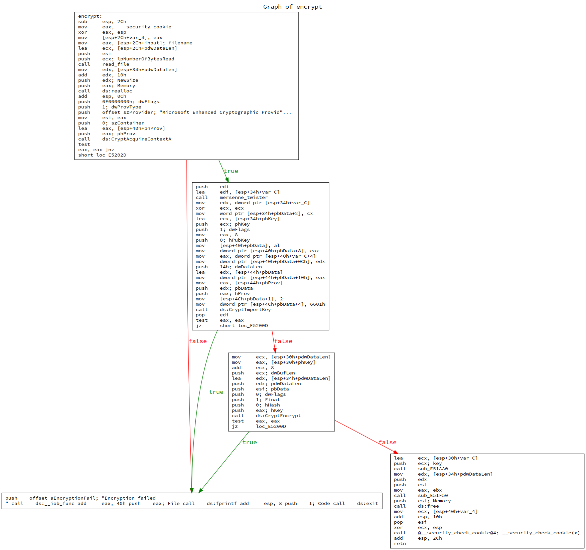
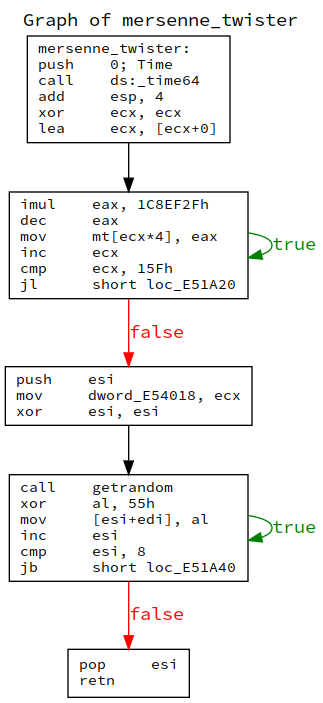
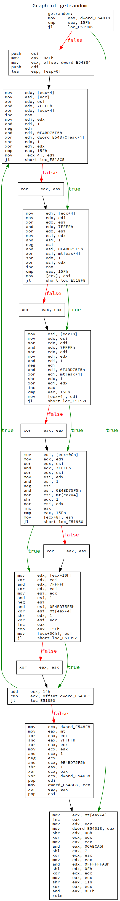
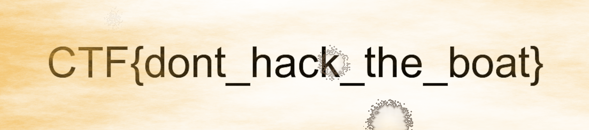

## Introduction

BsidesSF had really really good reverse engineering challenges, but I loved two challenges. One windows reverse challenge called chameleon and another esp32 firmware reverse challenge called smart-locky which I didn't manage to solve in time.

## The challenge

### Problem statment

We are given two files [chameleon.exe](chameleon.exe) and [flag.png.enc](flag.png.enc), this looks trivial enough we need to reverse the encryption algorithm to give us the original flag.png.

The problem statment also says that file was encrypted in the last months.

Reading the statment it looked like a simple challenge where you brute force the seed of a default mt19937 implementation, but the problem had only two solves, so I thought there must be some twist.

### First glance at the binary

When you first execute the binary it gives you two options, to encrypt or decrypt files.

```

Usage: chameleon.exe [--encrypt|<--decrypt --id=<id>>] <infile> <outfile>

Example: chameleon.exe --encrypt plaintext.txt ciphertext.txt
Example: chameleon.exe --decrypt --id=abcd1234 ciphertext.txt plaintext.txt
```

I know where to look and I didn't focus on the decryption stuff to be honest.

### Reversing the binary

After identifying the encrypt function and changing some function names here is what the assembly looks like (you might want to zoom):



And here is what hexrays decompiler gives us after changing some types and variable names:

```c
void __usercall encrypt(const CHAR *output@<ebx>, const CHAR *input)
{
  void *file_content;
  BYTE *new_file_ptr;
  FILE *v4;
  DWORD pdwDataLen;
  HCRYPTKEY phKey;
  HCRYPTPROV phProv;
  byte pbData[20];
  char v9[8];

  file_content = read_file(input, &pdwDataLen);
  new_file_ptr = (BYTE *)realloc(file_content, pdwDataLen + 16);
  if ( !CryptAcquireContextA(&phProv, 0, "Microsoft Enhanced Cryptographic Provider v1.0", 1u, 0xF0000000) )
    goto failure;
  mersenne_twister((int)v9);                    // generate 8 byte key
  *(_WORD *)&pbData[2] = 0;
  pbData[0] = 8;
  *(_DWORD *)&pbData[8] = 8;
  *(_DWORD *)&pbData[12] = *(_DWORD *)v9;
  *(_DWORD *)&pbData[16] = *(_DWORD *)&v9[4];
  pbData[1] = 2;
  *(_DWORD *)&pbData[4] = 26113;
  if ( !CryptImportKey(phProv, pbData, 0x14u, 0, 1u, &phKey)
    || !CryptEncrypt(phKey, 0, 1, 0, new_file_ptr, &pdwDataLen, pdwDataLen + 8) )
  {
failure:
    v4 = _iob_func();
    fprintf(v4 + 2, "Encryption failed\n");
    exit(1);
  }
  sub_E51AA0((int)v9);
  sub_E51F50(output, new_file_ptr, pdwDataLen);
  free(new_file_ptr);
}
```

All right looks simple enough, here are the algorithm steps:

- call to CryptAcquireContextA, this is like an encryption algorithm factory in windows
- call to a function that I called mersenne_twister
- sets some values in pbData
- call to CryptImportKey
- call to CryptEncrypt

If you read this [tutorial](https://docs.microsoft.com/en-us/windows/win32/seccrypto/example-c-program--importing-a-plaintext-key) you can understand how *CryptImportKey* works.

This is an example key blob from the page above:

```c
BYTE DesKeyBlob[] = {
    0x08,0x02,0x00,0x00,0x01,0x66,0x00,0x00, // BLOB header 
    0x08,0x00,0x00,0x00,                     // key length, in bytes
    0xf1,0x0e,0x25,0x7c,0x6b,0xce,0x0d,0x34  // DES key with parity
    };
```

We can see that our example also uses DES using CBC mode of operation, we also see that DES is passed as the last 8 bytes (with byte of parity) of the array.

Ok so the bread and butter of this problem is knowing how mersenne twister works.

#### Reversing mersenne_twister

This is what the code looks like:



We can see that there are two loops.

Here is the decompiled code, it looks really clean after some type changes

```c
char __usercall mersenne_twister@<al>(int a1@<edi>)
{
  int v1; // eax
  signed int v2; // ecx
  unsigned int v3; // esi
  char result; // al

  v1 = time64(0);
  v2 = 0;
  do
  {
    v1 = 29945647 * v1 - 1;
    mt[v2++] = v1;
  }
  while ( v2 < 351 );
  dword_E54018 = v2;
  v3 = 0;
  do
  {
    result = getrandom() ^ 0x55;
    *(_BYTE *)(v3++ + a1) = result;
  }
  while ( v3 < 8 );
  return result;
}
```

If you implemented mersenne twister, the first loop is the set seed function, this is gonna put numbers in an array I call mt.

The interesting part to notice is the call to time64, the twister is seeded with current time.

Let's reverse getrandom now

#### Reversing getrandom

Here is what the code looks like:



The decompiled code looks good enough.

```c
int getrandom()
{
  int v0; // eax
  int v1; // eax
  int *v2; // ecx
  int v3; // esi
  int v4; // eax
  int v5; // edi
  unsigned int v6; // esi
  int v7; // eax
  int v8; // esi
  unsigned int v9; // edi
  int v10; // eax
  int v11; // edi
  unsigned int v12; // esi
  int v13; // eax
  unsigned int v14; // esi
  unsigned int v15; // ecx
  int v16; // ecx

  v0 = dword_E54018;
  if ( dword_E54018 >= 351 )
  {
    v1 = 175;
    v2 = &dword_E54384;
    do
    {
      v3 = *v2;
      v4 = v1 + 1;
      *(v2 - 1) = ((*(v2 - 1) ^ (*v2 ^ *(v2 - 1)) & 0x7FFFFu) >> 1) ^ dword_E5437C[v4] ^ -((*((_BYTE *)v2 - 4) ^ (unsigned __int8)(*(_BYTE *)v2 ^ *((_BYTE *)v2 - 4))) & 1) & 0xE4BD75F5;
      if ( v4 >= 351 )
        v4 = 0;
      v5 = v2[1];
      v6 = ((v3 ^ (v3 ^ v2[1]) & 0x7FFFFu) >> 1) ^ mt[v4] ^ -(((unsigned __int8)v3 ^ (unsigned __int8)(v3 ^ *((_BYTE *)v2 + 4))) & 1) & 0xE4BD75F5;
      v7 = v4 + 1;
      *v2 = v6;
      if ( v7 >= 351 )
        v7 = 0;
      v8 = v2[2];
      v9 = ((v5 ^ (v5 ^ v2[2]) & 0x7FFFFu) >> 1) ^ mt[v7] ^ -(((unsigned __int8)v5 ^ (unsigned __int8)(v5 ^ *((_BYTE *)v2 + 8))) & 1) & 0xE4BD75F5;
      v10 = v7 + 1;
      v2[1] = v9;
      if ( v10 >= 351 )
        v10 = 0;
      v11 = v2[3];
      v12 = ((v8 ^ (v8 ^ v2[3]) & 0x7FFFFu) >> 1) ^ mt[v10] ^ -(((unsigned __int8)v8 ^ (unsigned __int8)(v8 ^ *((_BYTE *)v2 + 12))) & 1) & 0xE4BD75F5;
      v13 = v10 + 1;
      v2[2] = v12;
      if ( v13 >= 351 )
        v13 = 0;
      v14 = ((v11 ^ (v11 ^ v2[4]) & 0x7FFFFu) >> 1) ^ mt[v13] ^ -(((unsigned __int8)v11 ^ (unsigned __int8)(v11 ^ *((_BYTE *)v2 + 16))) & 1) & 0xE4BD75F5;
      v1 = v13 + 1;
      v2[3] = v14;
      if ( v1 >= 351 )
        v1 = 0;
      v2 += 5;
    }
    while ( (signed int)v2 < (signed int)&dword_E548FC );
    dword_E548F8 = dword_E54638 ^ ((dword_E548F8 ^ (dword_E548F8 ^ mt[0]) & 0x7FFFFu) >> 1) ^ -(((unsigned __int8)dword_E548F8 ^ (unsigned __int8)(dword_E548F8 ^ LOBYTE(mt[0]))) & 1) & 0xE4BD75F5;
    v0 = 0;
  }
  v15 = mt[v0];
  dword_E54018 = v0 + 1;
  v16 = ((((v15 >> 11) ^ v15) & 0xCABCA5) << 7) ^ (v15 >> 11) ^ v15;
  return (unsigned __int8)(v16 ^ ((((v16 & 0xFFFFFFAB) << 15) ^ v16) >> 17));
}
```

Looks like a normal getrandom function from mt19937 but the is, this is not because the length of the array is 351, this is called mt11213.

#### Putting it all together

After looking on the internet for some constants I found this [page](http://www.ai.mit.edu/courses/6.836-s03/handouts/sierra/random.c), maybe we can work that.

The only difference with the program was the factor, also I had to change from long to int because this was written for a 32 bit machine (I spent two hours debugging this lol).

I wrote a program to generate all possible keys from october 2019 to february 2020.

```c
#include <math.h>
#include <stdio.h>

#define RAND_MASK 0x3FFFFFFF

#define N 351
#define M 175
#define R 19
#define TEMU 11
#define TEMS 7
#define TEMT 15
#define TEML 17

// long constants cannot be defined as enum in 16-bit compilers:
#define MATRIX_A 0xE4BD75F5
#define TEMB     0x655E5280
#define TEMC     0xFFD58000


static unsigned int mt[N];                 // state vector
static int mti=N;


extern void set_seed (int seed) {
  unsigned int s = (unsigned int)seed;
  for (mti=0; mti<N; mti++) {
    // s = s * 29943829 - 1;
    s = s *  29945647 - 1;
    mt[mti] = s;
  }
  return;
}

void dump() {
    for (int i = 0; i < N; i++) {
       printf("%x\n", mt[i]);
    }
}

int genrandom () {
  // generate 32 random bits
  unsigned int y;
  if (mti >= N) {

    const unsigned int LOWER_MASK = (1u << R) - 1; // lower R bits
    const unsigned int UPPER_MASK = -1 << R;       // upper 32-R bits
    int kk, km;
    //for (kk=0, km=M; kk < N-1; kk++) {
    for (kk=0, km=M; kk < N-1; kk++) {
      y = (mt[kk] & UPPER_MASK) | (mt[kk+1] & LOWER_MASK);
      mt[kk] = mt[km] ^ (y >> 1) ^ (-(y & 1) & MATRIX_A);
      //printf("%x\n", mt[kk]);
      if (++km >= N) km = 0;
    }

    y = (mt[N-1] & UPPER_MASK) | (mt[0] & LOWER_MASK);
    mt[N-1] = mt[M-1] ^ (y >> 1) ^ (-(unsigned int)(y & 1) & MATRIX_A);
    mti = 0;
  }
  y = mt[mti++];
  //printf("%x\n", y);
  y ^=  y >> TEMU;
  y ^= (y << TEMS) & TEMB;
  y ^= (y << TEMT) & TEMC;
  y ^=  y >> TEML;

  return y&0xff;
}

int main(void) {

    for (int t = 1569888000 /*1546300800*/; t < 1582583270; t++) {
        set_seed(t);
        // dump();
        for (int i = 0; i<8; i++) {
            printf("%x", genrandom() ^ 0x55);
        }
        printf("\n");
    }
}
```

This generates a 263 MiB file:

```sh
gcc  bruteforce.c && ./a.out > keys.txt
```

Then I wrote a little program in python to try to brute force the key, since we know that the file is png, and the first 8 bytes are fixed.

```python
from Crypto.Cipher import DES
cipher = "cd0c8716e99ae841".decode("hex")

with open("keys.txt") as myfile:
    lines = myfile.read().splitlines()
p = 0.01
pas = p
l = float(len(lines))
for i, key in enumerate(lines):
    if i / l >= p:
        print("{}%".format(p * 100))
        p += pas
    keyh = key
    key = key.zfill(16).decode("hex")
    out = DES.new(key).decrypt(cipher)
    if out[0] == chr(0x89) and out[1] == chr(0x50) and out[2] == chr(0x4e) and out[3] == chr(0x47) and \
        out[4] == chr(0x0d) and out[5] == chr(0xa) and out[6] == chr(0x1a) and out[7] == chr(0x0a):
        print("FOUND .....")
        print(keyh)
        exit(0)
```

After 5 minutes I find the key, and I decrypt the image:

```python
from Crypto.Cipher import DES
key = "a051b8a16f8542da".decode("hex")
with open("flag.png.enc") as myfile:
    image=  myfile.read()

content = DES.new(key, DES.MODE_CBC, IV="\x00" * 8).decrypt(image)

with open("flag.png", "w") as myfile:
    myfile.write(content)
```

And yaas! we have the flag


