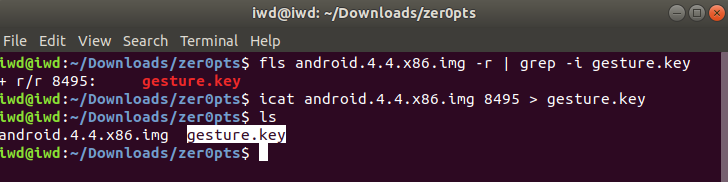
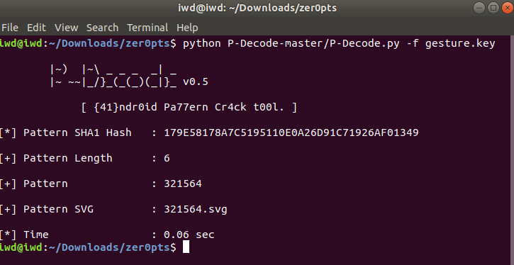
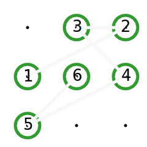
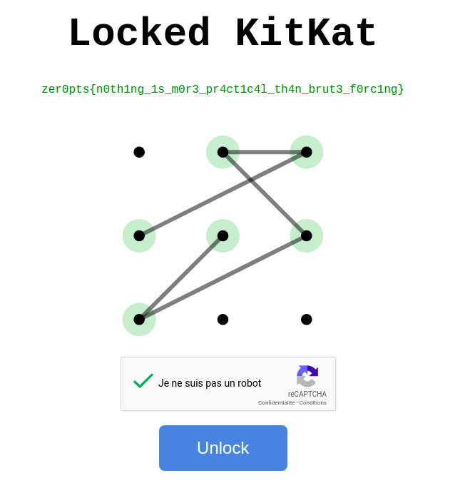

# Locked kitkat


The challenge :
We've extracted the internal disk from the Android device of the suspect. Can you find the pattern to unlock the device? Please submit the correct pattern here.

Extract gesture.key

Method 1 : 
mount the given image and search for gesture.key , which is usually on data/system/

```sh
$ mkdir andr
$ sudo mount -o loop android.4.4.x86.img andr
$ find andr/ -name gesture.key
```


Method 2: extract using fls : 

first we need to search for parameter of the file which we want to extract! 

```sh
$fls android.4.4.x86.img -r | grep -i gesture.key
+ r/r 8495:    gesture.key
```

Now we know the address of gesture.key , extract it using icat

```sh
$icat android.4.4.x86.img 8495 > gesture.key
```

And now we get the file. 



I'I crack the gesture Using [P-Decode](https://github.com/MGF15/P-Decode ) we can easily get the pattern of the phone

```sh
$python P-Decode-master/P-Decode.py -f gesture.key
```





 And we get the pattern in image. Finally We submit at the given website and get the flag



```
zer0pts{n0th1ng_1s_m0r3_pr4ct1c4l_th4n_brut3_f0rc1ng}
```

