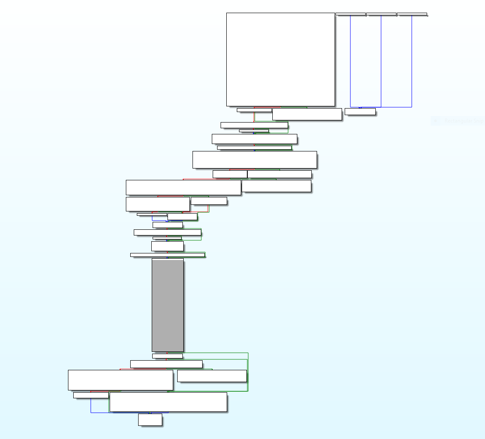
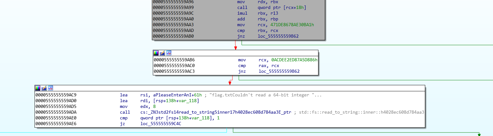

# Introduction

We played tamuctf 2020, it was a 10 day long beginner to intermediate level ctf, 20 teams solved all the problems, we didn't solve all the problems unfortunately and we ended in rank 25.

The reverse problems were simple/okay-ish, most of them are in rust.


# The challenge

This writeup is about a problem called splatter calc, it's a rust binary that asks for an initial rng

```bash
kali@kali:/mnt/shared/ctfs/tamuctf20/rev$ ./splatter-calc
Please enter an initial rng: 1
Oops, you didn't guess the right number. You got 13896084676171490950 with final state 62298657904
71643905
```

## Analysis of the binary

Here is what the CFG looks like:



This looks really simple for a rust binary.

What interests us in the node in grey.

The code looks like this:

```asm
.text:0000555555559945                 mov     eax, ebx
.text:0000555555559947                 and     eax, 7
.text:000055555555994A                 shl     rax, 4
.text:000055555555994E                 mov     rdi, [rsp+rax+138h+var_B0]
.text:0000555555559956                 mov     rax, [rsp+rax+138h+var_A8]
.text:000055555555995E                 mov     esi, 0CAFEBABEh
.text:0000555555559963                 mov     rdx, rbx
.text:0000555555559966                 call    qword ptr [rax+18h]
.text:0000555555559969                 mov     r13, 83F66D0E3h
.text:0000555555559973                 imul    rbx, r13
.text:0000555555559977                 mov     rbp, 24A452F8Eh
.text:0000555555559981                 add     rbx, rbp
.text:0000555555559984                 mov     ecx, ebx
.text:0000555555559986                 and     ecx, 7
.text:0000555555559989                 shl     rcx, 4
.text:000055555555998D                 mov     rdi, [rsp+rcx+138h+var_B0]
.text:0000555555559995                 mov     rcx, [rsp+rcx+138h+var_A8]
.text:000055555555999D                 mov     rsi, rax
.text:00005555555599A0                 mov     rdx, rbx
.text:00005555555599A3                 call    qword ptr [rcx+18h]
.text:00005555555599A6                 imul    rbx, r13
.text:00005555555599AA                 add     rbx, rbp
.text:00005555555599AD                 mov     ecx, ebx

...
```

A function gets called based on the value of, ecx&7:

```assembly
.text:0000555555559966                 call    qword ptr [rax+18h]
```

I extracted all the functions:

```assembly
func_0:
mov     rax, rsi
retn

func_1:
lea     rax, [rsi+rdx]
retn

func_2:
mov     rax, rsi
sub     rax, rdx
retn

func_3:
mov     rax, rsi
imul    rax, rdx
retn

func_4:
mov     rax, rsi
imul    rax, rsi
retn

func_5:
mov     rcx, rdx
mov     rax, rsi
shl     rax, cl
retn

func_6:
mov     rcx, rdx
mov     rax, rsi
shr     rax, cl
retn

func_7:
mov     rax, rsi
xor     rax, rdx
retn
```

Finally the generated value needs to satisfy these constraints:



## Solving the binary

The algorithm is simple, so I rewrote it in python, if there was some delicate stuff that I couldn't implement correctly, I could have a used a symbolic execution framework like angr or triton for this.

```python
import z3

s = z3.Solver()

def do_operation(i, rsi, rdx):
    return z3.If((i & 7) == 0,
        rsi,
        z3.If((i & 7) == 1,
            rsi + rdx,
            z3.If((i & 7) == 2,
                rsi - rdx,
                z3.If((i & 7) == 3,
                    rsi * rdx,
                    z3.If((i & 7) == 4,
                        rsi * rsi,
                        z3.If((i & 7) == 5,
                            rsi << (rdx & 8),
                            z3.If((i & 7) == 6,
                                rsi >> (rdx & 8),
                                rsi ^ rdx)))))))

rbx = z3.BitVec("input", 64)
r13 = 0x83F66D0E3
rbp = 0x24A452F8E
rsi = 0xCAFEBABE

for _ in range(8):
    rdx = rbx
    rax = do_operation(rbx, rsi, rdx)
    rbx = rbx * r13
    rbx = rbx + rbp
    ecx = (rbx & 0xffffffff)
    rsi = rax

s.add(0x471DE8678AE30BA1  == rbx)
s.add(0x0ACDEE2ED87A5D886 == rax)

print(s.check())
print(s.model())
```

And we get the value to use on the remote server

```bash
(hacking3) kali@kali:/mnt/shared/ctfs/tamuctf20/rev$ python solver.py
sat
[input = 982730589345]
```

